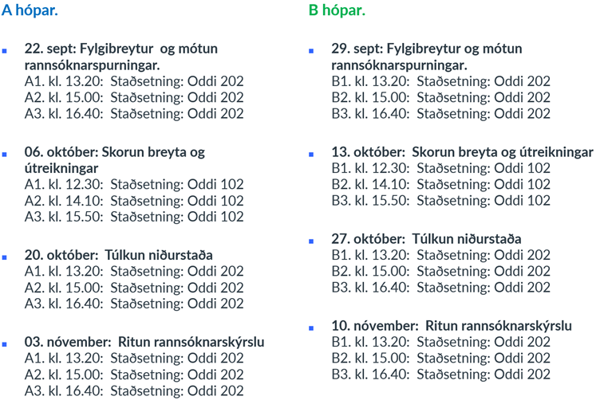
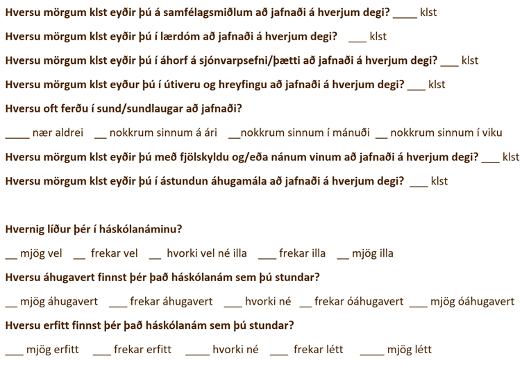

```{r setup, include=FALSE}
options(htmltools.dir.version = FALSE)
library(kableExtra)
knitr::opts_chunk$set(
  cache = FALSE,
  echo = FALSE,
  message = FALSE, 
  warning = FALSE,
  hiline = TRUE
)
```

```{r xaringan-themer, include=FALSE, warning=FALSE}
library(xaringanthemer)
style_duo_accent(
  primary_color = "#10099F",
  secondary_color = "#0098AA",
  inverse_header_color = "#FFFFFF",
  inverse_background_color = "#10099F", 
  colors = c(red = "#ff0019", black = "#000000"), inverse_text_color = "#FFFFFF", text_font_url = 'https://fonts.googleapis.com/css2?family=Jost&display=swap',  
)

library(xaringanExtra)
use_tile_view()
```

class: center, middle
background-image: url(images/HI_merki.png)
background-size: 125px
background-position: 5% 92%

# Túlkun niðurstaða


### Persónuleikasálfræði


Jón Ingi Hlynsson  
[jih10@hi.is](mailto:jih10@hi.is)  
<br>
Ísak Örn Ívarsson  
[ioi8@hi.is](mailto:ioi8@hi.is)  


#### Háskóli Íslands 

#### Haustönn 2023  


---
class: center middle inverse

### Textasmíði er skipulögð hugsun


Að vera fær í að skrifa eflir getu okkar til þess að hugsa


---

# Dagskrá verkefnatíma

```{r, out.width="70%", fig.align='center'}

```


---

.center[
.middle[# **Persónuleikakvarðarnir**]
]

.pull-left[
**EPQ-SS** ([Eysenck, Eysenk og Barrett, 1985](https://www.sciencedirect.com/science/article/abs/pii/0191886985900261)). Þetta próf inniheldur 48 atriði og er mæling á þriggja þátta líkani um persónuleika. Þættirnir nefnast **Taugaveiklun**, **Úthverfa**, **Harðlyndi** og einnig er kvarði er metur samkvæmi skala (e. *lie scale*). 

**PANAS** ([Watson, Clark & Tellegen, 1988](https://sci-hub.wf/10.1037/0022-3514.54.6.1063)). Þetta próf inniheldur 20 atriði sem meta þættina **Jákvæðar** og **Neikvæðar** tilfinningar. Þessir þættir mátast vel á persónuleikaþættina **Úthverfa** og **Taugaveiklun**. Hvor þáttur er metinn með 10 atriðum. 

**Týpa D** ([Denollet, 2005](https://journals.lww.com/psychosomaticmedicine/Fulltext/2005/01000/DS14__Standard_Assessment_of_Negative_Affectivity,.13.aspx?casa_token=OiWbMw1e9Y0AAAAA:h-ROJOqjkFTtUpURzXfCN6MriOhRnV6IudoQsU3nEAcdhsvsQibq9-_rXOd5L-sf-EjkCirW4TxBIjOwUqUjOpzZ)). Þetta próf er 14 atriði og meta þau þættina **neikvæðar tilfinningar** og **félagslega hömlun** (7 atriði per þátt). Skor ***beggja þátta*** er notað til að skilgreina Týpu D þar sem skor 10 eða hærra á báðum kvörðum er nauðsynlegt. 
]

.pull-right[
**LOT-R** ([Scheier, Carver & Bridges, 1994](https://sci-hub.wf/10.1037/0022-3514.67.6.1063)). Þetta próf inniheldur 6 atriði og metur **bjartsýni** og **svartsýni** (þrjú atriði per þátt). Prófið er bæði skorað fyrir öll sex atriði þar sem hátt skor telst bjartsýni en lágt svartsýni, en einnig er hægt að skora hvorn þátt fyrir sig.  

**HEXACO-60 atriða listinn** ([Lee og Ashton, 2004](https://www.tandfonline.com/doi/epdf/10.1207/s15327906mbr3902_8?needAccess=true)). Prófið metur sex persónuleikaþætti skv. HEXACO módelinu. Þeir eru, **heiðarleiki-auðmýkt** (e. *honesty-humility*), **tilfinningasemi** (e. *emotionality*), **úthverfa**, **samvinnuþýði**, **samviskusemi** og **víðsýni**.
]


---

.pull-left[# Fylgibreytur

- DASS
- Perceived Stress Scale
- Coping Styles Inventory for stressful situations
- Spurningalisti um áhyggjur
- WHO-5 Well-being index
- Sjálfmyndarkvarði Rosenberg
- Svefnleysiskvarði
- Spurningar um reykingar og áfengisneyslu
- Heilsufarslisti – sállíkamleg einkenni
- Hvatvísi
- Lífsánægjukvarðinn
- Quality of Life Scale
- Húmorstílar
- Tilfinningastjórnun
]

.pull-right[
# Aukaspurningar

```{r}

```


]


---

# Hvað þarf að koma fram í niðurstöðukafla?

--

Til þess að túlka niðurstöður þarf (alla jafna) amk. þrennar upplýsingar:  
1. Stærð úrtaks
2. Marktækni (e.*significance*)
3. Áhrifastærð (e. *effect size*)

--

### Án þessara upplýsinga verður túlkunin merkingarlaus

--

**Þetta er allt saman hægt að kalla fram í Jasp og Jamovi!**

---

# Skoðið þið *mean imputation* skjalið frá Ísaki!!!

```{r}
knitr::include_app("https://jonhlynsson.github.io/personality/MI.html", height = 500)
```


---

# Sniðmát fyrir verkefnið

[Smella hér](https://haskoliislands.instructure.com/courses/24852/files/2567191?wrap=1)


---
class: center middle inverse


# Takk fyrir tímann í dag


